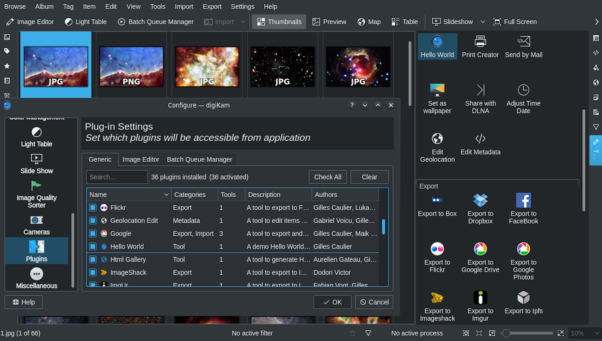
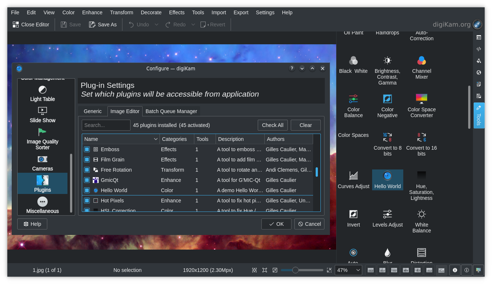
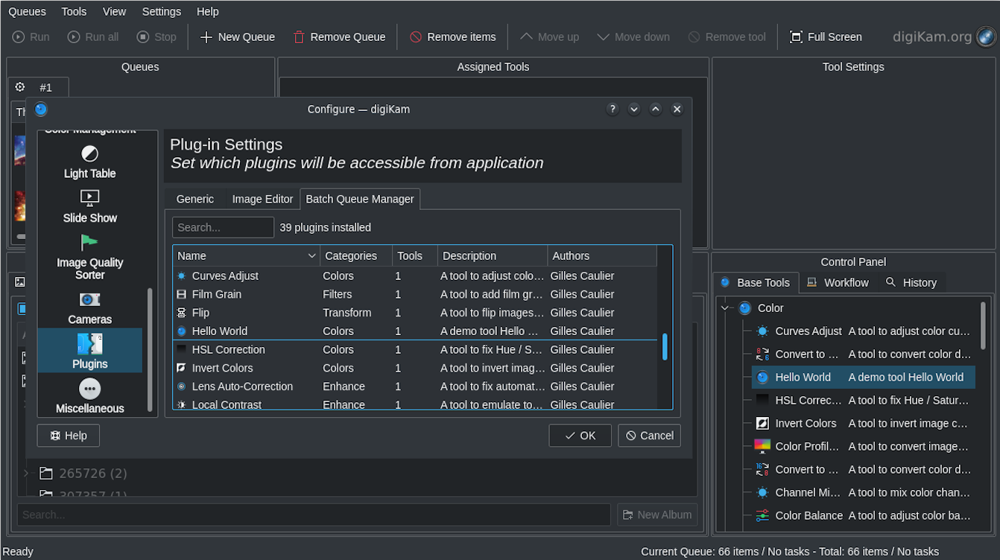

### Description:

This repository guest some demo codes to write new external digiKam plugins (Digikam::DPlugin).
It provides 3 "Hello World" plugins as:

- Generic tool.
  [](data/digikam_generic_helloworld.png)

- Image Editor tool.
  [](data/digikam_editor_helloworld.png)

- Batch Queue Manager tool.
  [](data/digikam_bqm_helloworld.png)

### Dependencies:

- CMake           >= 3.1.0      (https://cmake.org/)            All plugin types
- Qt              >= 5.6.0      (https://www.qt.io/)            All plugin types
- DigikamCore     >= 6.3.0      (https://www.digikam.org)       Generic and editor plugin
- DigikamDatabase >= 6.3.0      (https://www.digikam.org)       BQM plugin only
- DigikamGui      >= 6.3.0      (https://www.digikam.org)       BQM plugin only

### Compilation:

```
# ./bootstrap.sh
# cd build
# make
```

### Install:

```
# cd build
# sudo make install/fast
```

### Uninstall:

```
# cd build
# sudo make uninstall
```
